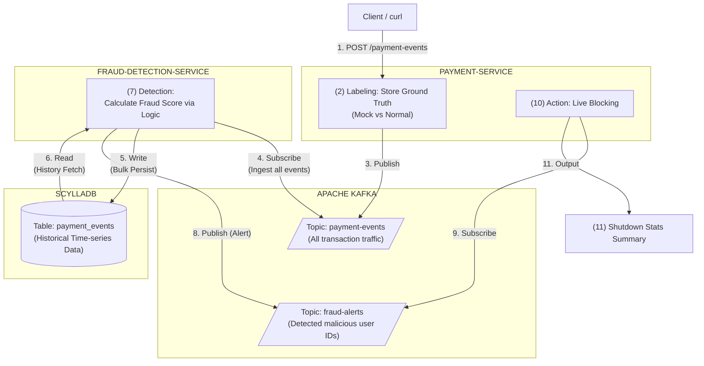

# fraudx architecture




# Detection rules
1. velocity/frequency (same card/device_id used M times in N min)
    - ScyllaDB TTL (Time To live) + Time Window Compaction Strategy (TWCS)
1. Transactional pattern deviation (amount deviates 3σ from user mean)
    - ScyllaDB Counter Column

# procedures
```zsh
make up
make logs-fraud

make post-event n=10000000

make fraud-rps

make cql
```


# TODO
- [ ] [payment service] fraudulent payment event 実装
    - 動的にmessage内容を変え、memoryにIDを保持
- [ ] [fraud detection service] detection logic 実装
- [ ] [payment service + fraud detection service] payment service に API call (精度計算のため)


