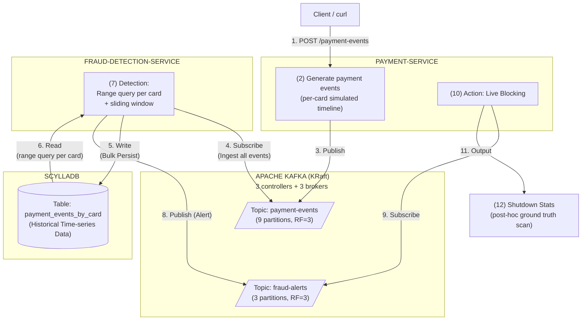
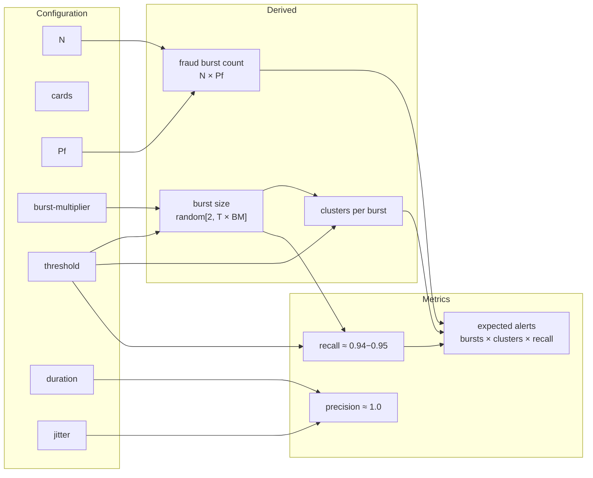

# architecture



For the detailed fraud detection logic, see [docs/fraud-detection-logic.md](docs/fraud-detection-logic.md).

# procedures

Prerequisites: Docker, Java 25

```zsh
# build JARs, recreate containers, and tail payment-service logs
make up

# (in a separate terminal) tail fraud-detection-service logs
make logs-fraud

# trigger event generation (N=10M)
make post-event n=10000000

# monitor consumer lag at http://localhost:8888 (Kafka UI)
# wait until payment-events topic lag reaches 0 before proceeding

# stop fraud-detection-service and print consumer RPS
make fraud-rps

# stop payment-service and print shutdown stats (confusion matrix, latency, etc.)
make payment-stats
```

# benchmark results

## machine spec

- CPU: Apple M4 Pro, 12 cores (8P + 4E)
- RAM: 48GB

## configuration

- **N**: 10,000,000 events (burst — all published in a single POST request)
- **Fraud rule**: threshold=5, duration=1m (`common/src/main/resources/rules.yaml`)
- **Cards**: 10,000 (`BENCHMARK_CARDS` in `compose.yaml`)
- **Fraud probability**: 0.00004 (`BENCHMARK_FRAUD_PROBABILITY` in `compose.yaml`)
- **Burst multiplier**: 3 (`BENCHMARK_BURST_MULTIPLIER` in `compose.yaml`)
- **Jitter min**: 5s (`BENCHMARK_JITTER_MIN` in `compose.yaml`)
- **Jitter max**: 12h (`BENCHMARK_JITTER_MAX` in `compose.yaml`)

Events use simulated per-card timestamps with jitter between 5s and 12h.
Fraud bursts use variable size: `random[2, threshold * burst-multiplier]` = [2, 15].
Ground truth is computed post-hoc at shutdown via full ScyllaDB scan.

## parameter relationships



## results

| N | Cards | Pf | Jitter | Threshold | Duration | Producer RPS | Consumer RPS | Precision | Recall | TP | FP | FN | Latency p50 | Latency p99 |
|---|-------|------|--------|-----------|----------|-------------|-------------|-----------|--------|----|----|----|----|-----|
| 10M | 10K | 0.00004 | 5s-12h | 5 | 1m | 494,715 | 94,068 | 1.0000 | 0.9478 | 1,923 | 0 | 106 | 43,369ms | 85,254ms |
