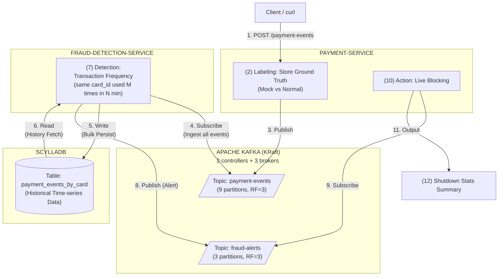

# architecture



For the detailed fraud detection logic, see [docs/fraud-detection-logic.md](docs/fraud-detection-logic.md).

# prerequisites

- Docker
- Java 25

# procedures

```zsh
# build JARs, recreate containers, and tail payment-service logs
make up

# (in a separate terminal) tail fraud-detection-service logs
make logs-fraud

# trigger event generation (N=10M)
make post-event n=10000000

# monitor consumer lag at http://localhost:8888 (Kafka UI)
# wait until payment-events topic lag reaches 0 before proceeding

# stop fraud-detection-service and print consumer RPS
make fraud-rps

# stop payment-service and print shutdown stats (confusion matrix, latency, etc.)
make payment-stats
```

# machine spec

- CPU: Apple M4 Pro, 12 cores (8P + 4E)
- RAM: 48GB

# benchmark results

## configuration

- **N**: 10,000,000 events (burst — all published in a single POST request)
- **Fraud rule**: threshold=5, duration=1m (`common/src/main/resources/rules.yaml`)
- **lookback**: 9,500 (`SCYLLA_LOOKBACK` in `compose.yaml`)

Each card simulates up to 7 days of activity (max events per card = 7 days / duration).
This bounds per-card event count to a realistic range derived from the rule's time
resolution, not an arbitrary constant.

Ground truth is recorded at generation time (batch_id + timestamp only), not by
post-hoc scan of all events. Post-hoc scan would require holding all N events in
memory grouped by card_id; recording only fraud batch_ids (~1,000) avoids this.
As a trade-off, test data generation is deterministic: fraud events are clustered
within `duration`, normal events are exactly spaced by `duration`. This means
precision is structurally 100% (normal events never trigger the rule) and threshold
does not affect results. The only tuning variable is `lookback`, which controls
recall by determining how many recent events per card are examined.

## results

| Metric | Value |
|--------|-------|
| Producer RPS | 742,455 |
| Consumer RPS | 120,214 |
| Recall | 99.00% |
| Precision | 100% (structural) |
| Confusion matrix | TP=993, FP=0, FN=10 |
| Detection latency p50 | 43.4s |
| Detection latency p99 | 69.6s |

**Detection latency context**: All 10M events are burst-published in 13.5s, but the
consumer takes 83s to process them. Detection latency measures alert arrival time
minus mini-batch generation time, so it includes the full consumer lag (~70s) caused
by burst ingestion. Under steady-state traffic, consumer lag does not accumulate
and detection latency would be proportional to single-batch processing time.
