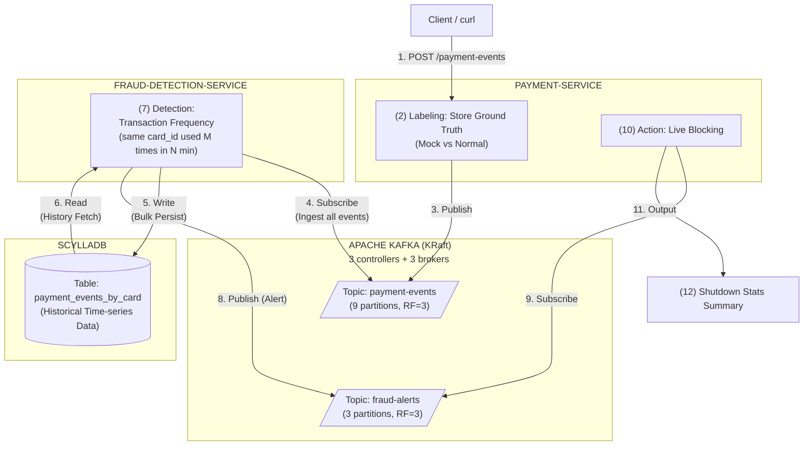

# fraudx architecture



For the detailed fraud detection logic, see [docs/fraud-detection-logic.md](docs/fraud-detection-logic.md).

## prerequisites

- Docker
- Java 25

## procedures

```zsh
# build JARs, recreate containers, and tail payment-service logs
make up

# (in a separate terminal) tail fraud-detection-service logs
make logs-fraud

# trigger event generation (N=10M)
make post-event n=10000000

# monitor consumer lag at http://localhost:8888 (Kafka UI)
# wait until payment-events topic lag reaches 0 before proceeding

# stop fraud-detection-service and print consumer RPS
make fraud-rps

# stop payment-service and print shutdown stats (confusion matrix, latency, etc.)
make payment-stats
```

## machine spec

| | |
|---|---|
| CPU | Apple M4 Pro, 12 cores (8P + 4E) |
| RAM | 48GB |

## benchmark results (N=10M)

Fraud rules are configured in `common/src/main/resources/rules.yaml`.
Duration is fixed at 1m across all runs. Duration defines the ground truth:
fraud events are clustered within `duration`, normal events are spaced by `duration`.
Changing duration does not affect results because it is used to construct the correct
answers, not as a variable under test. Recall varies with threshold because higher
threshold increases events per card, reducing lookback coverage.

Each card simulates up to 7 days of activity (max events per card = 7 days / duration).
This bounds per-card event count to a realistic range derived from the rule's time
resolution, not an arbitrary constant.

Ground truth is recorded at generation time (batch_id + timestamp only), not by
post-hoc scan of all events. This keeps memory proportional to fraud count (~1000),
not to N.

| threshold | lookback | Producer RPS | Consumer RPS | Precision | Recall | Latency p50 | Latency p99 |
|-----------|----------|-------------|-------------|-----------|--------|-------------|-------------|
| 5 | 1000 | 656K | 111K | 100% | 81.4% | 44.2s | 74.6s |
| 10 | 1000 | - | - | - | - | - | - |
| 20 | 1000 | - | - | - | - | - | - |
