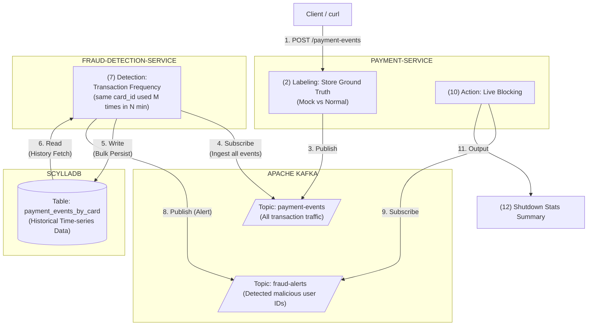

# fraudx architecture


```mermaid
flowchart TD
Client["Client / curl"]

subgraph PS ["PAYMENT-SERVICE"]
  PS1["(2) Labeling: Store Ground Truth\n(Mock vs Normal)"]
  PS2["(10) Action: Live Blocking"]
end

subgraph Kafka ["APACHE KAFKA"]
  T1[/"Topic: payment-events\n(All transaction traffic)"/]
  T2[/"Topic: fraud-alerts\n(Detected malicious user IDs)"/]
end

subgraph FD ["FRAUD-DETECTION-SERVICE"]
  FD1["(7) Detection:\nTransaction Frequency\n(same card_id used M times in N min)"]
end

subgraph DB ["SCYLLADB"]
  DB1[("Table: payment_events_by_card\n(Historical Time-series Data)")]
end

Stats["(12) Shutdown Stats Summary"]

Client -- "1. POST /payment-events" --> PS1
PS1 -- "3. Publish" --> T1
T1 ~~~ T2
FD1 -- "4. Subscribe\n(Ingest all events)" --> T1
FD1 -- "5. Write\n(Bulk Persist)" --> DB1
DB1 -- "6. Read\n(History Fetch)" --> FD1
FD1 -- "8. Publish (Alert)" --> T2
PS2 -- "9. Subscribe" --> T2
PS2 -- "11. Output" --> Stats
```


# procedures
```zsh
make up
make logs-fraud

make post-event n=10000000

make fraud-rps
make payment-stats
```
